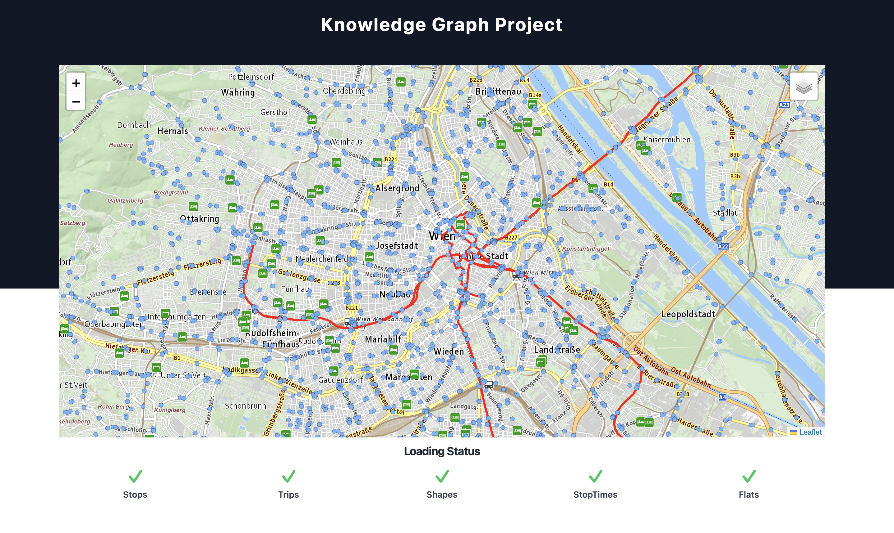

# Knowledge Graph-based, transit-oriented Real Estate Valuation 



An intelligent real estate platform for Vienna that combines **GTFS public transport data** and **Willhaben property listings** into an RDF Knowledge Graph. The system applies **Logical Reasoning** (rule-based inference), **Knowledge Graph Embeddings (RotatE)** via PyKEEN, and a **Random Forest Regressor** (Extended Late Fusion) to detect undervalued properties ("Good Deals") and visualize them in an interactive Angular map application. The shapes have been removed from the map in order to increase performance.

---

## How to get started 
To keep the repository small, we decided to not include any housing information or GTFS data in the project.
Therefore, you find the corresponding descriptions on how to download the information in the folders:
* src/assets/data/README.md
* helpers/wh/README.md 

After you successfully downloaded all data, make sure you have installed the Angular CLI.
If not, you find information regarding the CLI at `https://angular.io/cli`.

Then, you can build and run the project. 
Run `ng serve` for a dev server. Navigate to `http://localhost:4200/`. 
The application will automatically reload if you change any of the source files.

# Option 1: Quickstart

If you just want to run and explore the Angular map application using the pre-generated dataset (`map_data.json`) and the public transport data, you do not need to execute any Python scripts or train machine learning models.

# Prerequisites

- Node.js (v18+ recommended) & npm
- Git

# Start the Application

## 1 Clone the repository

```
git clone https://github.com/hasanguenes/kg_project.git
cd kg_project
```

## 2 Install dependencies

```
npm install
```

## 3 Start local development server

```
ng serve
```

Now you can open the browser and navigate to `http://localhost:4200`

---

# Option 2: Full Backend & ML Pipeline (Reproducing the Knowledge Graph)

If you want to re-run the complete data pipeline from scratch — parsing raw GTFS transit stops, running semantic reasoning, training the RotatE embedding model, and training the price regressor — follow these steps.

## Prerequisites

- Python (v3.10 or v3.11 recommended)
- Pip & Git

## 1 Clone the repository

```
git clone https://github.com/hasanguenes/kg_project.git
cd kg_project
```

## 2 Create and activate a virtual environment

```
python -m venv venv

# On Windows (PowerShell):
.\venv\Scripts\Activate.ps1

# On macOS / Linux:
# source venv/bin/activate
```

## 3 Install the required Python packages:

```
pip install -r requirements.txt
```

## 4 Run the Pipeline Scripts in Order

### 4.1 Build the Base KG

Parses GTFS transit data and raw flat JSON, calculates spatial distances, and builds the initial RDF graph.

```
python src/2_construction/build_graph.py
```

### 4.2 Execute Logical Reasoning

Applies graph rules, computes shortest paths via NetworkX (travel times to hubs like Stephansplatz, Hauptbahnhof, Karlsplatz), classifies semantic types (CentralFlat, WellConnectedFlat), and adds proximity edges.

```
python src/3_logic/reasoning.py
```

### 4.3 Train Knowledge Graph Embeddings (PyKEEN / RotatE)

Filters out literal attributes to focus purely on structural topology and trains the RotatE embedding model.

```
python src/4_ml/train_kge_without_literals.py
```

### 4.4 Train the Price Regressor

Extracts entity embeddings, handles complex numbers, and trains a Random Forest Regressor to predict property prices.

```
python src/4_ml/train_regressor.py
```

### 4.5 Generate Frontend Map Data

Combines ML price predictions with semantic rules to export the final dataset for the UI.

```
python src/4_ml/generate_map_data.py
```

## 5 Start the Application

### 5.1 Install dependencies

```
npm install
```

### 5.2 Start local development server

```
ng serve
```

Now you can open the browser and navigate to `http://localhost:4200`

---

# Inspection of Embeddings

You can inspect vector embeddings by running the analysis scripts in `src/4_ml/`:

- PCA Analysis: `python src/4_ml/evaluate_embeddings_pca.py`
- TP / FP Analysis of Link Prediction: `python src/4_ml/evaluate_tp_fp_link_predictions.py`
- Inspection of values of some vector embeddings: `python src/4_ml/export_embedding_examples.py` 